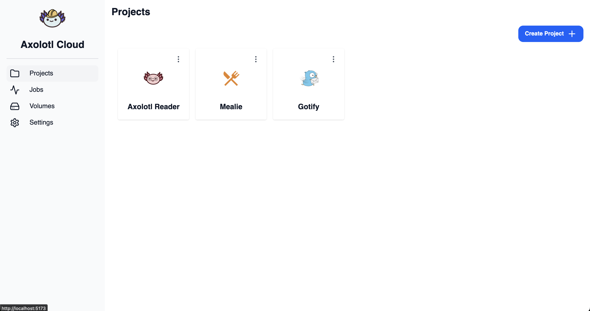
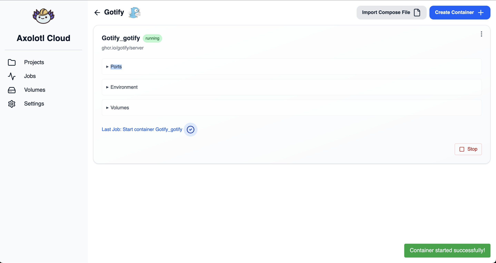
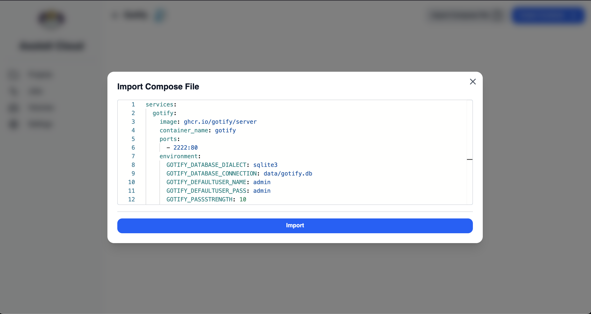
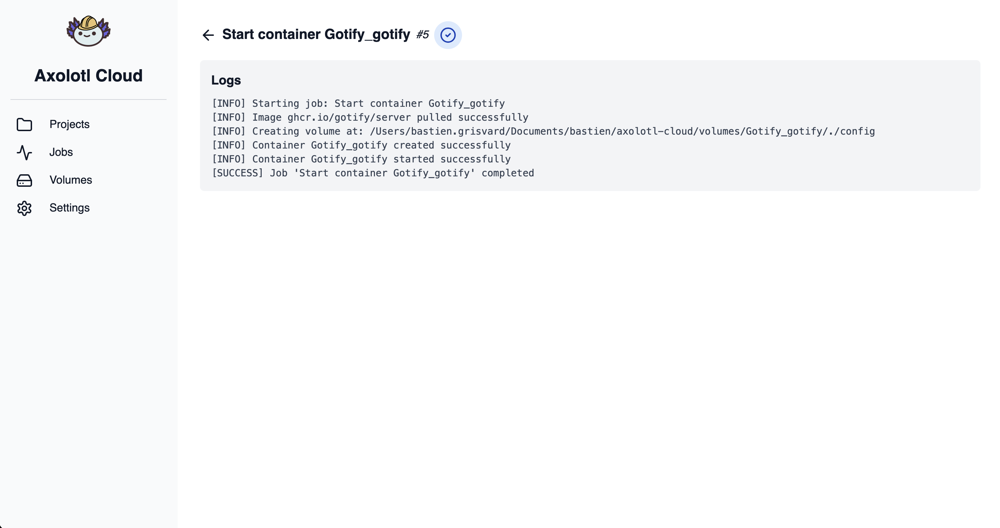
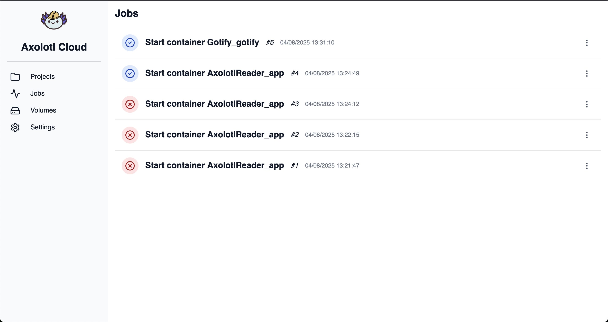
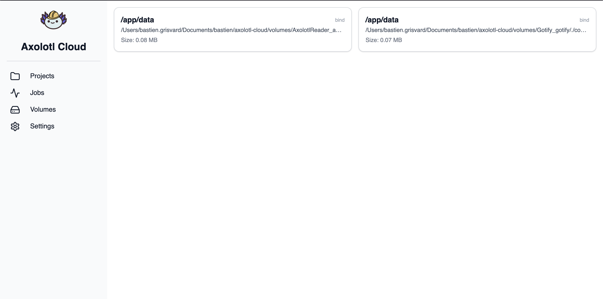

<p align="center">
  
</p>

<h1 align="center">Axolotl Cloud</h1>


<p align="center">
  <strong>Axolotl Cloud</strong> is a lightweight, self-hosted platform to manage and run Docker-based projects.<br/>
  Easily create, import, and manage containers per project — all from a clean and intuitive web UI.
</p>


<br/>

[](https://github.com/users/bastien2203/packages/container/package/axolotl-cloud)

---

## ✨ Features

- 📦 Organize containers by project
- 🔁 Import containers from Docker Compose files
- 🧪 Run, stop containers 
- 📋 View detailed API logs and job history
- 💾 Visualize and manage volumes

---

## 📸 Screenshots

<p align="center">
  
  <br/>Project List

  <br/><br/>
  
  <br/>Project Details — All containers of a project (with run/stop actions)

  <br/><br/>
  
  <br/>Import Docker Compose files

  <br/><br/>
  
  <br/>Container Logs — View logs of a container

  <br/><br/>
  
  <br/>Job List — See all jobs (start/stop/create containers) and their status

  <br/><br/>
  
  <br/>Volume List — Visualize volumes and their usage
</p>

---

## 🚀 Quick Start

### 1. Create required directories:

```sh
mkdir -p ./volumes ./data
```

### 2. Add a `compose.yaml` file:

```yaml
services:
  app:
    image: ghcr.io/bastien2203/axolotl-cloud:latest
    ports:
      - "8080:8080"
    environment:
      HTTP_PORT: 8080
      ENV: production
      VOLUMES_PATH_HOST: /home/user/axolotl-cloud/volumes
      VOLUMES_PATH_CONTAINER: /app/volumes
      GIN_MODE: release
      DATABASE_PATH: /app/data/data.db
    volumes:
      - /home/user/axolotl-cloud/volumes:/app/volumes
      - /home/user/axolotl-cloud/data:/app/data
      - /var/run/docker.sock:/var/run/docker.sock
```

### 3. Start the application:

```sh
docker compose up -d
```

### 4. Access the web UI:
Open your browser and go to [http://localhost:8080](http://localhost:8080).

## 📌 Roadmap

- [ ] Build container from project (git repo url)
- [ ] Public project templates (e.g. Redis, Mealie, etc.)
- [ ] User authentication & management
- [ ] Volume backups & restore
- [ ] Docker image management (list, delete, pull)
- [ ] Link from container card to volume details
- [ ] Visualize container logs
- [ ] Add webstockets for real-time updates

